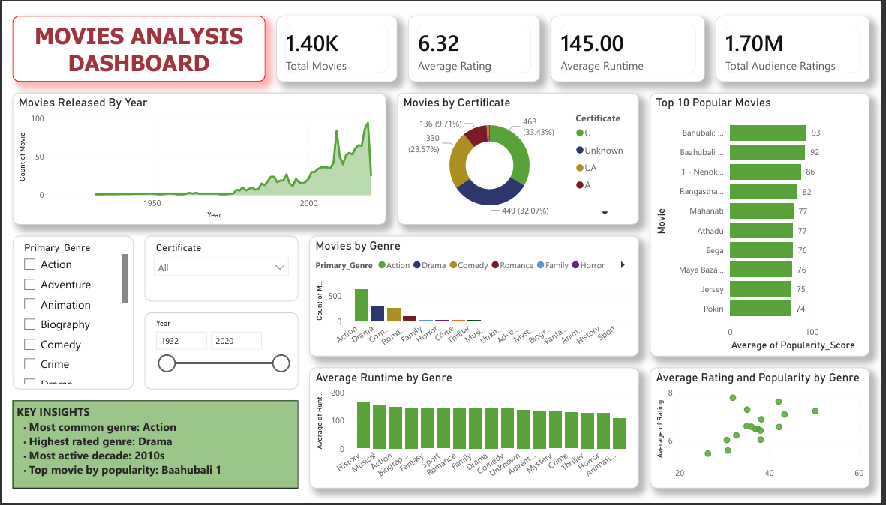

# 🎬 Movie Analytics Dashboard

An end-to-end **data analytics project** built using **Python, SQL, and Power BI** to analyze movie trends, ratings, popularity, runtime, genre distribution, and release patterns.

This project demonstrates the complete analytics workflow:

**Data Cleaning → SQL Analysis → Dashboarding → Insight Generation**

---

# 📌 Project Overview

This project focuses on analyzing a movie dataset to uncover meaningful patterns and business-style insights such as:

- How movie production changed over time
- Which genres are most frequent
- Which genres receive higher ratings
- Which movies are most popular
- How runtime varies across genres
- How movies are distributed across certificate categories

The objective of this project is to convert raw movie data into a structured and interactive analytics solution.

---

# 🛠 Tech Stack

- **Python** – Data cleaning and preprocessing
- **Pandas / NumPy / Matplotlib / Seaborn**
- **SQL (MySQL)** – Exploratory and analytical querying
- **Power BI** – Interactive dashboard creation

---

# 📂 Dataset Features

The dataset includes the following movie attributes:

- Movie Title
- Primary Genre
- Rating
- Runtime
- Popularity Score
- Certificate
- Release Year
- Number of Ratings

---

# ⚙️ Project Workflow

## 1. Data Cleaning & Preprocessing (Python)
The dataset was first cleaned and prepared using Python.

### Steps performed:
- Handled missing values
- Standardized column names
- Cleaned and formatted data types
- Created useful derived columns such as:
  - **Decade**
  - **Movie Age**
- Exported a cleaned dataset for SQL analysis and Power BI dashboarding

---

## 2. SQL Analysis
SQL was used to answer key analytical questions and generate structured insights.

### Sample analysis performed:
- Total number of movies
- Average rating and runtime
- Top 10 most popular movies
- Genre-wise movie distribution
- Highest-rated genres
- Certificate-wise distribution
- Decade-wise movie trends
- Runtime analysis by genre

---

## 3. Dashboard Development (Power BI)
An interactive dashboard was created in Power BI to visualize the most important insights from the dataset.

### Dashboard includes:
- KPI Cards
- Movie Release Trend Over Time
- Movies by Certificate
- Top 10 Most Popular Movies
- Genre-wise Movie Count
- Average Runtime by Genre
- Rating vs Popularity Analysis
- Interactive Filters
- Key Insights Panel

---

# 📊 Dashboard Preview

> Add your dashboard screenshot below after uploading it to the `outputs` folder.



---

# 🔍 Key Insights

Some major insights derived from this project include:

- Movie production increased significantly after **2000**
- **Action** is the most frequent genre
- **Drama** has the highest average rating
- The **2010s** were the most active decade
- **Baahubali 1** emerged as the most popular movie

---

# 📁 Project Structure

```bash
Movie-Analysis-DashBoard/
│
├── dashboard/        # Power BI dashboard file (.pbix)
├── data/             # Raw and cleaned datasets
├── notebooks/        # Jupyter notebook for preprocessing and EDA
├── outputs/          # Dashboard screenshots / output images
├── sql/              # SQL analysis queries
└── README.md
```

---

# 🚀 How to Use This Project

## 1. Clone the repository
```bash
git clone https://github.com/your-username/Movie-Analysis-DashBoard.git
```

## 2. Explore the notebook
Open the Jupyter notebook inside the `notebooks/` folder to view the preprocessing and analysis steps.

## 3. Run SQL queries
Use the SQL file inside the `sql/` folder in MySQL Workbench or any SQL environment.

## 4. Open the dashboard
Open the `.pbix` file inside the `dashboard/` folder in Power BI Desktop.

---

# 📌 Future Improvements

Possible future enhancements for this project:

- Add recommendation-based insights
- Include sentiment/review-based analysis
- Create a second dashboard page for advanced analytics
- Publish the dashboard online
- Add movie revenue / box office analysis (if data is available)

---

# 💡 What I Learned

Through this project, I strengthened my skills in:

- Data cleaning and preprocessing
- SQL-based analytical thinking
- Dashboard design and storytelling
- Converting raw data into actionable insights

---

# 👤 Author

**Lohith Burra**

If you found this project interesting, feel free to connect or share feedback.
